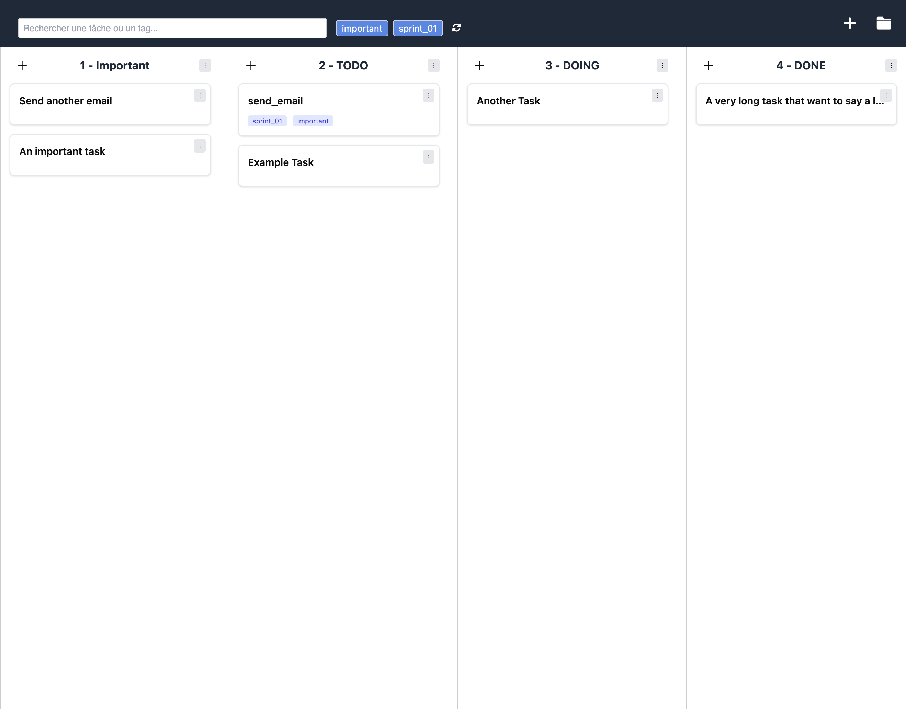

# Markdown Task Manager 📝

Welcome to **Markdown Task Manager**, a simple and elegant task management board inspired by [Tasks.md](https://github.com/BaldissaraMatheus/Tasks.md/tree/main). This project is designed to help you organize your tasks efficiently, all within a single HTML file.

## Features ✨

- **Drag-and-Drop Interface**: Easily move tasks between lanes.
- **Markdown Parsing**: Create tasks using markdown syntax.
- **Tag Filtering**: Filter tasks by tags for better organization.
- **Customizable Lanes**: Add, rename, or delete lanes as needed.
- **Search Functionality**: Quickly find tasks or tags.

## Screenshot 📸

## Acknowledgements 🙌

This project is inspired by [Tasks.md](https://github.com/BaldissaraMatheus/Tasks.md/tree/main). Special thanks to its creator for the inspiration!

## How to Use 🚀

1. Open the `tasks.html` file in your browser.
2. Start adding lanes and tasks.
3. Use markdown syntax to create tasks with tags.
4. Filter tasks by tags or search for specific tasks.

## License 📄

This project is licensed under the terms of the [MIT License](LICENSE).
